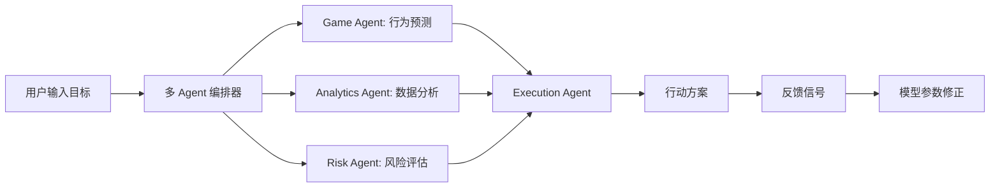

# Dark Office Agent

> 如果你正在加班，建议先躲进厕所再看这篇文档。
> 不是为你好，是怕你笑着笑着哭出来，同事以为你疯了。

《暗黑职场 / Dark Office Agent》正在从一个职场卡牌生存原型，演进成一个多 Agent 协作的 AI 职场生存模拟与策略训练系统。

它解决的不是“怎么在办公室里变得阳光开朗”，而是更现实的问题：

- 信息不对称：很多规则没人明说，但每个人都在按它行动。
- 决策复杂：老板、同事、客户、指标、风险互相牵制。
- 隐性经验难学：现实中试错成本太高，游戏里至少可以重开。
- 数据与行动脱节：知道利润、库存、销量变了，但不知道下一步该怎么做。

所以这个项目现在有两条腿：一条是卡牌驱动的职场模拟训练，一条是多 Agent 驱动的数据分析与行动决策。

---

## 当前进展

截至当前主线，项目已经具备这些能力：

| 模块 | 当前状态 | 说明 |
| --- | --- | --- |
| 职场卡牌模拟 | 可运行 | Python/SQLite 持久化原型，支持角色、事件、行动、回合结算、失败判定 |
| 剧情线系统 | 可运行 | 支持剧情线 CRUD、激活、推进、分支与多结局方向 |
| 素材库与蒸馏 | 可运行 | 可导入新闻案例、历史事件和个人经历，再蒸馏为卡牌素材 |
| 规则可视化 | 已搭建 | 可导出机制快照并生成 `docs/visualizations/game-mechanics.html` |
| Agent Skill | 可交付 | `skill/adapter.ts` 作为 Node.js 到 Python 的桥接层 |
| 职场参谋 Skill | MVP | `skill/advisor/` 提供职场顾问风格的策略输出模板 |
| 多 Agent 决策框架 | 已搭建 | `src/agents/` 支持 Game / Analytics / Risk / Execution Agent 编排 |
| 微信小程序架构 | 已设计 | `docs/project/wechat-mini-program-architecture.md` 定义小程序与云开发方案 |
| 微信小程序工程 | 分支内已搭建 | `codex/multi-agent-framework` 分支包含小程序页面、组件、云函数工程文件 |

---

## 核心产品形态

### 1. 策略模拟 Agent（Game Agent）

基于卡牌机制与行为博弈模型，模拟老板、同事、客户、门店负责人、一线员工等角色的激励结构。

它负责回答：

- 当前局面里谁有影响力？
- 每个角色真正想要什么？
- 哪些行动看起来正确，但会埋下后患？
- 用户该如何在低确定性环境里做一个可复盘的选择？

现有基础：

- `runtime/engine.py`：Python 回合结算引擎
- `runtime/rules.py`：动作、档位、时段、隐患等共享规则
- `runtime/storylines.py`：剧情线管理
- `src/agents/game-agent.ts`：多 Agent 框架里的行为模拟 Agent

### 2. 数据分析 Agent（Analytics Agent）

接入经营数据，例如利润、库存、销量、客流、折扣、人力成本，通过分析识别关键经营因子。

它负责回答：

- 利润变化最可能和哪些指标有关？
- 哪些因子值得优先干预？
- 数据建议的置信度是多少？
- 下一轮试点应该观察哪些反馈？

现有基础：

- `src/agents/analytics-agent.ts`
- `data/analytics/store-profit-sample.json`
- `npm run agents:demo`

### 3. 执行与反馈 Agent（Execution Agent）

把策略转成行动路径，并把执行结果反向喂回模型参数。

它负责回答：

- 第一步该做什么？
- 谁负责？
- 多久复盘？
- 成功信号是什么？
- 如果结果不好，下一轮调哪个参数？

现有基础：

- `src/agents/execution-agent.ts`
- `src/agents/risk-agent.ts`
- `src/agents/orchestrator.ts`

---

## 工作流



示例目标：

- “提升门店利润”
- “设计职场晋升路径”
- “降低跨部门项目背锅风险”
- “找出库存和利润之间的关键矛盾”

---

## 分支地图

当前仓库保留了几条有意义的分支。它们不是“哪个是最终版”的关系，更像是几条演化路线。

| 分支 | 内容 | 状态 |
| --- | --- | --- |
| `main` | 当前主线，包含持久化模拟器、剧情线、规则可视化、职场参谋 MVP、多 Agent 决策框架、微信架构文档 | 推荐阅读入口 |
| `online` | 早期线上化探索，重点是职场参谋模块、分支剧情和多结局能力 | 内容已基本进入后续分支和主线 |
| `codex/wechat` | 微信小程序方向的架构与机制可视化分支，加入微信产品架构文档和规则可视化页面 | 已合入主线 |
| `codex/multi-agent-framework` | 多 Agent 框架分支，额外包含完整小程序工程骨架、云函数目录、页面组件、演示 HTML 和工作区补充文件 | 比主线更新，适合继续做产品化开发 |

如果你只想了解项目现在是什么，看 `main`。

如果你想继续做微信小程序或云函数落地，看 `codex/multi-agent-framework`。

---

## 仓库结构

```text
docs/                     # 正式文档事实源
├── INDEX.md              # 文档地图
├── architecture/         # 多 Agent 架构设计
├── project/              # 项目定位、范围、微信架构
├── design/               # 核心循环、进程推进、结局方向
├── systems/              # 卡牌系统、回合流程、判定规则
├── visualizations/       # 机制总览与结构化规则可视化
├── content/              # 角色池、事件库、应对库
├── collaboration/        # 开发规范、交接文档
└── archive/              # 历史资料

runtime/                  # Python 规则执行与数据存取
├── db.py                 # SQLite 持久化
├── engine.py             # 回合结算引擎
├── rules.py              # 共享规则表
├── mechanics.py          # 机制快照导出
├── content.py            # Character/Event dataclass
├── materials.py          # 素材库与自定义卡牌管理
├── branches.py           # 分支剧情辅助逻辑
└── storylines.py         # 剧情线 CRUD 与推进

src/agents/               # TypeScript 多 Agent 决策框架
├── game-agent.ts         # 行为博弈与策略模拟
├── analytics-agent.ts    # 经营数据分析
├── risk-agent.ts         # 风险评分
├── execution-agent.ts    # 行动路径与反馈策略
├── orchestrator.ts       # 多 Agent 并行编排
└── demo.ts               # 示例入口

skill/                    # 可交付 Agent Skill
├── adapter.ts            # Node.js -> Python 桥接
├── darkoffice-persistent-skill.md
└── advisor/              # 职场参谋 MVP

scripts/                  # 初始化、调试、运维脚本
├── game_state_cli.py
├── render_mechanics_visual.py
├── distill_template.py
├── simulate_balance.py
└── verify_skill.sh

data/                     # 卡牌、素材与分析样例
deploy/                   # Skill 发布清单与模板
release/                  # 打包产物
wechat/                   # 微信小程序工程，仅在产品化分支完整存在
```

---

## 快速上手

### Python 原生版

```bash
python3 scripts/game_state_cli.py init
python3 scripts/game_state_cli.py create demo
python3 scripts/game_state_cli.py turn demo --action EMAIL_TRACE --mod 3
python3 scripts/game_state_cli.py show demo
```

### 素材库与剧情线

```bash
python3 scripts/game_state_cli.py material-list
python3 scripts/game_state_cli.py material-search --keyword 腐败
python3 scripts/game_state_cli.py storyline-list
python3 scripts/game_state_cli.py storyline-activate demo --storyline-id demo_arc
```

### 机制可视化

```bash
python3 scripts/game_state_cli.py mechanics
python3 scripts/render_mechanics_visual.py
```

输出页面：

```text
docs/visualizations/game-mechanics.html
```

### Agent Skill 适配层

```bash
npm run skill:health
npm run skill:init
npm run skill:create -- demo
npm run skill:turn -- demo --action EMAIL_TRACE --mod 3
npm run skill:show -- demo
```

### 多 Agent 决策 Demo

```bash
npm run agents:demo
npm run agents:demo:workplace
```

`agents:demo` 会读取 `data/analytics/store-profit-sample.json`，输出门店利润提升策略。

`agents:demo:workplace` 会输出职场晋升路径策略。

---

## 重要文档

建议按这个顺序读：

1. [docs/INDEX.md](/Users/niunan/project/darkoffice/docs/INDEX.md)
2. [docs/project/README.md](/Users/niunan/project/darkoffice/docs/project/README.md)
3. [docs/architecture/multi-agent-framework.md](/Users/niunan/project/darkoffice/docs/architecture/multi-agent-framework.md)
4. [docs/project/wechat-mini-program-architecture.md](/Users/niunan/project/darkoffice/docs/project/wechat-mini-program-architecture.md)
5. [docs/systems/README.md](/Users/niunan/project/darkoffice/docs/systems/README.md)
6. [docs/visualizations/README.md](/Users/niunan/project/darkoffice/docs/visualizations/README.md)
7. [docs/content/README.md](/Users/niunan/project/darkoffice/docs/content/README.md)
8. [docs/collaboration/development-guidelines.md](/Users/niunan/project/darkoffice/docs/collaboration/development-guidelines.md)

---

## 验证命令

```bash
npm run typecheck
npm test
bash scripts/verify_skill.sh
```

---

## 下一步

短期优先级：

1. 把 `codex/multi-agent-framework` 里的微信小程序工程择机合入主线。
2. 将 `src/agents/` 的输出接入现有卡牌、剧情线和素材库。
3. 为 Analytics Agent 增加多元回归、异常检测和分组对比。
4. 为 Execution Agent 增加任务状态、复盘记录和人工确认节点。
5. 在微信云函数或独立服务中暴露 `runDecision` API。

长期方向：

- 训练：让用户在高不确定性职场局面里反复演练。
- 决策：让经营数据变成可执行动作，而不是停留在报表上。
- 反馈：让每次行动都更新模型假设，形成持续学习闭环。

---

## 最后

这项目不会承诺让你在职场里战无不胜。

但如果它能让你在做选择前多想一层，让你知道哪些坑不是你的错，让你把混乱局面拆成可执行动作，那它就有用。

现实里不能重开，至少这里可以先模拟一遍。
