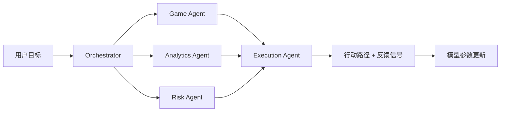

# Dark Office Agent 多 Agent 框架

## 目标

Dark Office Agent 的新框架把现有「职场卡牌模拟」扩展为「模拟训练 + 数据决策」双能力系统，服务两类目标：

- 职场策略训练：处理晋升、协作、背锅风险、资源争取等高不确定性情境。
- 经营策略决策：接入利润、库存、销量、客流、折扣、人工成本等数据，识别关键因子并输出行动方案。

## 模块边界



## Agent 职责

| Agent | 职责 | 当前实现 |
| --- | --- | --- |
| Game Agent | 建立职场或经营博弈场景，生成策略选项和行为预测 | 确定性角色/选项评分 |
| Analytics Agent | 分析经营数据，识别利润相关因子 | 相关系数 + 置信度 + 建议 |
| Risk Agent | 评估目标、数据和周期带来的执行风险 | 规则化风险评分 |
| Execution Agent | 合并多 Agent 信号，输出行动路径和反馈指标 | 策略排序 + 三步执行计划 |
| Orchestrator | 并行调度 Agent 并汇总结果 | `Promise.all` 并行推理 |

## 设计原则

- 先可运行闭环，后接入真实模型与企业系统。
- Agent 输出结构化信号，不直接输出不可审计的内部思维。
- 数据分析结论必须带置信度、证据和可执行建议。
- 执行计划必须包含反馈信号和参数更新规则，支撑持续学习。

## 当前入口

```bash
npm run agents:demo
npm run agents:demo -- workplace
```

经营数据示例位于 `data/analytics/store-profit-sample.json`。

## 下一步

1. 将 Game Agent 的策略选项接入现有卡牌/剧情线内容池。
2. 为 Analytics Agent 增加多元回归、异常检测和分组对比。
3. 为 Execution Agent 增加真实任务状态、复盘记录和人工确认节点。
4. 在微信云函数或独立服务中暴露 `runDecision` API。
