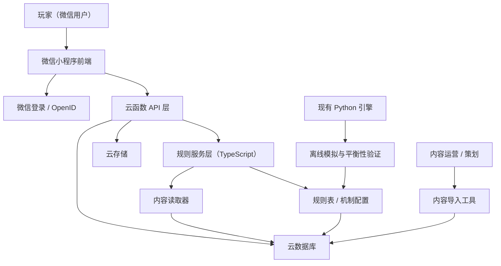
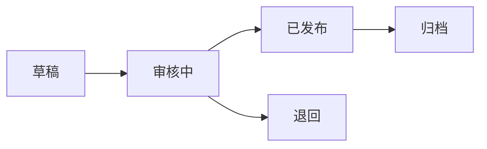

# 微信小程序正式产品架构设计

## 1. 文档目的

本文档定义《暗黑职场》从当前 CLI/Agent 原型演进为微信小程序游戏的正式产品架构。

目标不是简单迁移现有 Python 代码，而是建立一套可上线、可存档、可扩展剧情、可运营内容的微信小程序技术方案。

## 2. 结论

推荐架构：

`微信原生小程序前端 + 微信云开发后端 + 规则服务层 + 内容运营数据层`

当前项目中的 Python/SQLite 运行时继续作为规则原型与离线验证工具；正式线上版本将核心规则迁移为 TypeScript 云函数服务，并通过结构化内容表支持剧情扩展。

该方案优先满足：

- 微信登录与用户身份闭环
- 云端存档
- 剧情线与卡牌内容可扩展
- 小程序审核与发布路径清晰
- 后续可平滑扩展运营后台与数据分析

## 3. 设计范围

### 3.1 本阶段包含

- 微信小程序端页面架构
- 云开发后端架构
- 用户、存档、剧情、卡牌、回合日志数据模型
- 规则引擎线上化策略
- 内容扩展与发布流程
- 安全、风控、可观测性与迁移路线

### 3.2 本阶段不包含

- 小程序 UI 高保真稿
- 微信支付、广告变现与商业化系统
- 多人联机玩法
- 复杂运营后台实现
- 自建 Kubernetes / 微服务平台

## 4. 架构总览



核心原则：

1. 小程序端只负责表现、输入与轻量本地缓存。
2. 回合结算必须在服务端完成，避免客户端篡改数值。
3. 剧情、卡牌、规则配置必须结构化存储，避免写死在前端。
4. Python 引擎保留为验证工具，不作为线上请求链路。

## 5. 技术选型

| 层级 | 推荐方案 | 说明 |
| --- | --- | --- |
| 小程序前端 | 微信原生小程序 + TypeScript | 控制包体、适配审核、减少框架依赖 |
| 后端运行 | 微信云开发云函数 | 承接登录态、存档、回合结算 |
| 数据库 | 云数据库（文档型） | 适合卡牌、剧情、存档 JSON 结构 |
| 文件存储 | 云存储 | 后续存放卡面图、音效、剧情素材 |
| 规则语言 | TypeScript | 与小程序/云函数同栈，便于共享类型 |
| 离线验证 | 现有 Python runtime | 继续跑平衡性模拟与内容蒸馏 |
| 内容导入 | Node/Python 脚本 | 从现有 `data/cards` 与素材库导入云端 |

备选方案与取舍：

| 方案 | 优点 | 缺点 | 结论 |
| --- | --- | --- | --- |
| 微信原生 + 云开发 | 发布路径短，登录与云能力原生集成 | 云数据库复杂查询能力有限 | 推荐 |
| 微信原生 + 自建后端 | 长期灵活，适合多端 | 运维、鉴权、备案与成本更高 | 二期评估 |
| 小程序壳 + Python 服务 | 复用当前逻辑快 | 不符合长期产品化结构 | 不推荐作为正式底座 |

## 6. 小程序前端架构

### 6.1 页面结构

建议目录：

```text
miniprogram/
├── app.ts
├── app.json
├── app.wxss
├── pages/
│   ├── home/              # 开始、继续、剧情库入口
│   ├── storylines/        # 剧情线选择
│   ├── game/              # 主游戏回合界面
│   ├── archive/           # 存档列表
│   ├── recap/             # 回合回顾 / 死亡复盘
│   └── settings/          # 设置与数据管理
├── components/
│   ├── status-bar/
│   ├── event-card/
│   ├── action-sheet/
│   ├── hazard-strip/
│   ├── project-panel/
│   └── result-modal/
├── services/
│   ├── api.ts
│   ├── session.ts
│   └── cache.ts
└── types/
    ├── game.ts
    ├── content.ts
    └── api.ts
```

### 6.2 核心页面职责

| 页面 | 职责 | 关键交互 |
| --- | --- | --- |
| `home` | 游戏入口、继续存档、公告 | 新游戏、继续、剧情库 |
| `storylines` | 浏览官方剧情与已解锁剧情 | 选择剧情线、查看难度与标签 |
| `game` | 主回合体验 | 状态栏、事件、行动、结算动画 |
| `archive` | 管理多个存档 | 继续、删除、复制、查看状态 |
| `recap` | 复盘失败或阶段结束 | 查看关键选择、失败线、重开 |
| `settings` | 数据与隐私设置 | 清除本地缓存、用户协议入口 |

### 6.3 前端状态模型

小程序端维护三类状态：

| 状态 | 来源 | 是否可信 |
| --- | --- | --- |
| 当前回合展示态 | 服务端 `getPrompt` / `applyTurn` 返回 | 可信 |
| 选择中 UI 状态 | 本地组件 | 不可信，仅用于展示 |
| 最近存档摘要 | 本地缓存 + 服务端刷新 | 仅作缓存 |

禁止在前端直接计算最终数值、判定结果或剧情推进。

## 7. 后端云函数架构

### 7.1 云函数列表

| 云函数 | 输入 | 输出 | 说明 |
| --- | --- | --- | --- |
| `login` | 微信上下文 | 用户档案 | 获取 OpenID，创建或更新用户 |
| `listStorylines` | 用户上下文、筛选条件 | 剧情线摘要列表 | 展示可选剧情 |
| `createGameSession` | 剧情线 ID、难度、模式 | 存档与首回合提示 | 初始化游戏 |
| `getGameSession` | sessionId | 当前存档详情 | 恢复游戏 |
| `getNextPrompt` | sessionId | 下回合事件与行动选项 | 只读生成提示 |
| `applyTurn` | sessionId、actionType、可选自然语言 | 回合结算结果 | 核心写接口 |
| `listArchives` | 用户上下文 | 存档摘要列表 | 存档管理 |
| `deleteArchive` | sessionId | 删除结果 | 软删除优先 |
| `getRecap` | sessionId | 回合历史与关键节点 | 复盘 |
| `reportClientEvent` | 事件名、上下文 | 写入结果 | 埋点与异常上报 |

### 7.2 服务端分层

```text
cloudfunctions/
├── shared/
│   ├── types/
│   ├── rules/
│   ├── engine/
│   ├── repositories/
│   ├── validators/
│   └── telemetry/
├── login/
├── createGameSession/
├── getNextPrompt/
├── applyTurn/
├── listStorylines/
├── listArchives/
└── getRecap/
```

分层职责：

| 层 | 职责 |
| --- | --- |
| `functions` | 处理请求、鉴权、参数校验、错误格式化 |
| `engine` | 纯规则结算，不直接访问数据库 |
| `repositories` | 数据库读写与事务封装 |
| `rules` | 行动、档位、隐患、状态、失败线规则 |
| `validators` | 输入结构、内容合法性、状态机约束 |
| `telemetry` | 日志、埋点、异常归因 |

## 8. 数据模型

### 8.1 集合列表

| 集合 | 主键 | 说明 |
| --- | --- | --- |
| `users` | `_id` / `openid` | 用户档案 |
| `game_sessions` | `session_id` | 当前存档主表 |
| `turn_logs` | `_id` | 回合日志 |
| `storylines` | `storyline_id` | 剧情线定义 |
| `storyline_versions` | `version_id` | 剧情版本记录 |
| `cards` | `card_id` | 角色、事件、隐患、项目、机制卡 |
| `rule_sets` | `rule_set_id` | 规则版本 |
| `materials` | `material_id` | 原始素材与蒸馏来源 |
| `client_events` | `_id` | 埋点与异常 |

### 8.2 `game_sessions`

```json
{
  "session_id": "sess_xxx",
  "openid": "user_openid",
  "storyline_id": "story_intro_001",
  "storyline_version": "v1",
  "rule_set_id": "rules_2026_04",
  "day": 1,
  "turn_index": 0,
  "state": {
    "hp": 100,
    "en": 100,
    "st": 100,
    "kpi": 100,
    "risk": 0,
    "cor": 0
  },
  "statuses": [],
  "hazards": [],
  "projects": [],
  "current_act_index": 0,
  "status": "ACTIVE",
  "created_at": 1776873600000,
  "updated_at": 1776873600000,
  "deleted_at": null
}
```

### 8.3 `turn_logs`

```json
{
  "session_id": "sess_xxx",
  "openid": "user_openid",
  "turn_index": 1,
  "day": 1,
  "time_period": "上午",
  "character_id": "CHR_01",
  "event_id": "EVT_01",
  "action_type": "EMAIL_TRACE",
  "roll_value": 12,
  "total_score": 17,
  "result_tier": "SUCCESS",
  "delta": {"hp": 0, "en": -7, "st": -4, "kpi": 4, "risk": -4, "cor": 0},
  "state_after": {"hp": 100, "en": 93, "st": 96, "kpi": 100, "risk": 0, "cor": 0},
  "created_at": 1776873600000
}
```

### 8.4 `storylines`

```json
{
  "storyline_id": "story_intro_001",
  "title": "入职第一周",
  "description": "从直属上司的第一个深夜需求开始。",
  "version": "v1",
  "status": "PUBLISHED",
  "tags": ["新手", "职场压迫", "低风险"],
  "acts": [
    {
      "act_index": 0,
      "title": "第一幕：今晚先出方案",
      "character_id": "CHR_01",
      "event_ids": ["EVT_01"],
      "completion_condition": "turn_resolved",
      "branches": []
    }
  ],
  "endings": []
}
```

### 8.5 `cards`

```json
{
  "card_id": "EVT_01",
  "card_type": "EVENT",
  "card_name": "今晚先把新版方案出掉",
  "status": "PUBLISHED",
  "version": "v1",
  "payload": {
    "character_id": "CHR_01",
    "base_effect": {"hp": 0, "en": -18, "st": -12, "kpi": 3, "risk": 2, "cor": 0},
    "tags": ["加班", "上司", "短期绩效"]
  }
}
```

## 9. 规则引擎线上化

### 9.1 迁移策略

当前 Python 模块角色：

| 当前模块 | 线上目标 | 策略 |
| --- | --- | --- |
| `runtime/rules.py` | `cloudfunctions/shared/rules` | 转译为 TypeScript 常量与类型 |
| `runtime/engine.py` | `cloudfunctions/shared/engine` | 重写为纯函数引擎 |
| `runtime/content.py` | 云数据库 `cards` | 内置卡迁入内容集合 |
| `runtime/storylines.py` | 云数据库 `storylines` + 服务层 | 保留结构，迁移逻辑 |
| `scripts/simulate_balance.py` | 离线验证工具 | 继续使用，后续读取同一份规则 JSON |

### 9.2 引擎纯函数接口

```ts
type ResolveTurnInput = {
  session: GameSession;
  actionType: ActionType;
  contentContext: ContentContext;
  rngSeed?: string;
};

type ResolveTurnOutput = {
  turnLog: TurnLog;
  sessionPatch: Partial<GameSession>;
  nextPrompt: GamePrompt;
  ending?: GameEnding;
};
```

要求：

- 输入完整、输出完整。
- 引擎不直接读写数据库。
- 随机结果要可记录，必要时支持 seed 复盘。
- 每次规则变更必须更新 `rule_set_id`。

## 10. API 设计

### 10.1 通用响应结构

```json
{
  "ok": true,
  "request_id": "req_xxx",
  "data": {},
  "error": null
}
```

错误结构：

```json
{
  "ok": false,
  "request_id": "req_xxx",
  "data": null,
  "error": {
    "code": "SESSION_NOT_FOUND",
    "message": "存档不存在或已删除"
  }
}
```

### 10.2 `applyTurn`

输入：

```json
{
  "session_id": "sess_xxx",
  "action_type": "EMAIL_TRACE",
  "client_turn_index": 3
}
```

服务端校验：

1. `openid` 必须匹配存档所有者。
2. 存档状态必须为 `ACTIVE`。
3. `client_turn_index` 必须等于服务端当前回合。
4. `action_type` 必须存在于当前可用行动池。
5. 同一回合重复提交必须幂等处理。

输出：

```json
{
  "turn_result": {},
  "next_prompt": {},
  "session_summary": {}
}
```

## 11. 内容扩展机制

### 11.1 内容生命周期



### 11.2 内容版本规则

- 已发布剧情线不可原地破坏性修改。
- 新版本剧情线使用 `storyline_id + version` 区分。
- 已创建存档绑定创建时的 `storyline_version` 与 `rule_set_id`。
- 新内容发布只影响新开局，不影响旧存档。
- 紧急修复可通过兼容补丁处理，但必须记录迁移原因。

### 11.3 内容导入流程

1. 策划或 AI 从素材库生成卡牌 JSON。
2. 本地脚本校验 schema、字段、数值范围。
3. 离线模拟验证基础平衡性。
4. 导入云数据库为 `DRAFT`。
5. 人工审核后切换为 `PUBLISHED`。

## 12. 存档与一致性

### 12.1 存档策略

- 一个用户可以有多个存档。
- 每个存档绑定一个剧情线版本和规则版本。
- 回合结算采用“读 session -> 计算 -> 写 turn_log -> 更新 session”的原子语义。
- 如果云数据库事务能力受限，需要使用乐观锁字段 `version`。

### 12.2 幂等策略

`applyTurn` 需要支持幂等键：

```json
{
  "idempotency_key": "openid_session_turn_action_timestamp"
}
```

处理规则：

- 同一 `session_id + turn_index + idempotency_key` 重复请求返回同一结果。
- 如果 `client_turn_index` 过旧，返回最新存档摘要。
- 如果 `client_turn_index` 超前，返回 `TURN_INDEX_CONFLICT`。

## 13. 安全与风控

| 风险 | 处理策略 |
| --- | --- |
| 客户端篡改数值 | 结算只在云函数执行 |
| 越权读取存档 | 所有查询按 `openid` 过滤 |
| 重复点击导致多次结算 | 幂等键 + 回合版本号 |
| 内容配置错误 | schema 校验 + 发布状态流 |
| 用户数据删除要求 | 支持软删除与清除用户存档 |
| 敏感题材审核风险 | 文案分级、素材来源记录、避免现实主体指认 |

## 14. 可观测性

### 14.1 必要日志

- 云函数请求 ID
- openid 的脱敏标识
- session_id
- turn_index
- action_type
- result_tier
- failure_type
- 错误码

### 14.2 产品分析指标

| 指标 | 用途 |
| --- | --- |
| 新开局数 | 判断入口转化 |
| 第 1/3/5/10 回合留存 | 判断早期难度 |
| 常选行动分布 | 判断策略吸引力 |
| 平均存活回合 | 判断平衡性 |
| 失败类型分布 | 判断失败线是否过偏 |
| 剧情线完成率 | 判断内容质量 |

## 15. 发布与环境

建议环境：

| 环境 | 用途 | 数据 |
| --- | --- | --- |
| `dev` | 本地开发 | 测试卡牌与测试存档 |
| `staging` | 提审前验收 | 接近生产内容 |
| `prod` | 正式发布 | 正式用户数据 |

发布流程：

1. 本地开发者工具调试。
2. 云函数部署到 `dev`。
3. 自动化 smoke test。
4. 内容导入 `staging` 并试玩。
5. 小程序体验版验收。
6. 提交微信审核。
7. 审核通过后发布 `prod`。

## 16. 迁移路线

### 阶段 A：架构落地

- 新建 `miniprogram/` 与 `cloudfunctions/` 目录。
- 建立 TypeScript 类型定义。
- 实现 `login`、`createGameSession`、`applyTurn` 的最小闭环。
- 先导入内置角色、事件、行动、隐患。

### 阶段 B：规则迁移

- 将 `runtime/rules.py` 迁移为共享 JSON 或 TypeScript 常量。
- 将 `apply_turn` 逻辑重写为云函数纯函数。
- 建立 Python 与 TypeScript 结果对照测试。

### 阶段 C：剧情扩展

- 导入剧情线与卡牌内容集合。
- 支持剧情库选择、版本绑定、结局判定。
- 增加内容导入脚本与 schema 校验。

### 阶段 D：产品化

- 完成存档列表、死亡复盘、基础设置。
- 加入埋点、异常上报、用户数据删除流程。
- 准备体验版与审核材料。

## 17. 关键 ADR

### ADR-001：采用微信云开发作为首个正式后端

状态：接受

背景：

项目需要微信登录、云端存档、剧情内容扩展和低运维成本。

决策：

首个正式版本采用微信原生小程序 + 云开发云函数 + 云数据库。

后果：

- 优点：开发与发布路径短，微信生态集成成本低。
- 代价：数据库查询、后端运行环境和运维能力受云开发约束。
- 缓解：通过 repository 层隔离云数据库，保留未来迁移自建后端的可能。

### ADR-002：线上规则引擎迁移为 TypeScript

状态：接受

背景：

当前 Python 引擎适合原型和模拟，但线上小程序后端更适合与前端共享 TypeScript 类型。

决策：

线上规则引擎使用 TypeScript 纯函数实现，Python 继续作为离线验证工具。

后果：

- 优点：小程序、云函数、规则类型统一。
- 代价：短期需要双实现对照。
- 缓解：建立 fixtures，用相同输入对比 Python 与 TypeScript 输出。

### ADR-003：存档绑定剧情版本与规则版本

状态：接受

背景：

剧情和规则会持续扩展，老存档不能因为内容更新而失效。

决策：

每个 `game_session` 固定记录 `storyline_version` 和 `rule_set_id`。

后果：

- 优点：保证存档可复现。
- 代价：内容修复需要兼容旧版本。
- 缓解：只允许兼容补丁影响旧版本，破坏性更新发布新版本。

## 18. 当前限制

- 现有 Python/SQLite 数据结构不能直接作为线上数据库结构使用。
- 当前规则中“深夜”时段仍是预留状态，正式小程序版本需要决定是否启用更长工作日。
- 自定义卡牌已存在本地数据库状态，正式导入前需要区分官方内容与测试内容。
- 微信小游戏与普通小程序是不同产品路径；本设计按“微信小程序叙事游戏”处理，不按小游戏 Canvas 引擎处理。

## 19. 与其他文档的关系

- [positioning.md](/Users/niunan/project/darkoffice/docs/project/positioning.md) 定义项目定位。
- [scope-and-milestones.md](/Users/niunan/project/darkoffice/docs/project/scope-and-milestones.md) 定义阶段推进。
- [systems/turn-flow.md](/Users/niunan/project/darkoffice/docs/systems/turn-flow.md) 定义回合状态机。
- [systems/rules-and-resolution.md](/Users/niunan/project/darkoffice/docs/systems/rules-and-resolution.md) 定义结算原则。
- [visualizations/game-mechanics.html](/Users/niunan/project/darkoffice/docs/visualizations/game-mechanics.html) 展示当前规则引擎可视化。

## 20. 参考资料

- [微信小程序开发文档](https://developers.weixin.qq.com/miniprogram/dev/framework/)
- [微信小程序云开发入门](https://developers.weixin.qq.com/miniprogram/dev/wxcloud/basis/getting-started.html)
- [微信小程序云数据库文档](https://developers.weixin.qq.com/miniprogram/dev/wxcloud/reference-client-api/database/)
- [微信小程序云函数文档](https://developers.weixin.qq.com/miniprogram/dev/wxcloud/guide/functions.html)
